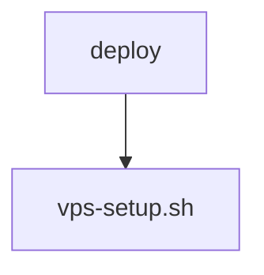

# 📚 hf-mount Documentation

Welcome to the complete documentation for this repository. This documentation is automatically generated and maintained by Woden Docbot.

   

## 🔗 Quick Links

[📂 deploy](./deploy/README.md)
[📋 Dependencies](./DEPENDENCIES.md)

---

> Deployment helpers and an orchestration script to provision a VPS and configure systemd services for running the hf-mount tooling.

## 📖 Overview

hf-mount provides deployment-level tooling to bring a virtual private server (VPS) into a runnable state for the hf-mount runtime. The repository focuses on installation, placement of binaries and configuration, and registering/enabling systemd service units so the hf-mount tooling runs under systemd supervision.

The core of the project is an orchestration Bash script (vps-setup.sh) and related deployment assets. vps-setup.sh sequences installation steps, installs or places the hf-mount tooling, edits or installs systemd unit files, and enables or registers those services, providing repeatable, operator-friendly provisioning for new servers.

### 🧩 Key Components

| Component | Purpose | Technologies |
| --- | --- | --- |
| **deploy** | Contains deployment-level assets and scripts used to provision a VPS, install the hf-mount tooling, and configure systemd services required to run hf-mount. | `bash`, `hf-mount tooling`, `systemd` |
| **vps-setup.sh** | The orchestration Bash script that performs installation steps, places configuration and binaries, and registers/enables systemd service units to run hf-mount on a newly provisioned VPS. | `bash`, `hf-mount tooling`, `systemd` |

**Component Architecture:**

### 🏗️ Architecture

Script-driven orchestration for provisioning a VPS and configuring systemd-managed services; deployment is procedural (Bash) and uses systemd for service management.

### 💡 Use Cases

- ✦ Provision and configure a VPS to run the hf-mount tooling
- ✦ Automate installation and registration of systemd service units for hf-mount
- ✦ Provide repeatable, documented deployment steps for operators or automation systems

### 🔧 Technologies

  

---

## 📑 Documentation Sections

### [deploy](./deploy/README.md)
Contains deployment helpers and scripts for provisioning a VPS, installing the hf-mount tooling, and configuring related systemd services.

This directory hosts deployment-level assets used to provision and configure a VPS with the project's hf-mount tooling.

---

## 📊 Documentation Statistics

- **Files Documented**: 1
- **Directories**: 2
- **Coverage**: 100%
- **Last Updated**: 2026-08-07

---

## 🧭 How to Navigate

> ℹ️ **INFO**
> Each directory has its own README.md with detailed information about that section. Use the breadcrumb navigation at the top of each page to navigate back to parent directories.

### Navigation Features

- **Breadcrumbs** - At the top of each page, showing your current location
- **Directory READMEs** - Each folder has a comprehensive overview
- **File Documentation** - Click through to individual file documentation
- **Search** - Use GitHub's search or your IDE's search functionality

---

## 🤖 About Woden DocBot

This documentation is automatically generated and kept up-to-date by Woden DocBot, an AI-powered documentation assistant. DocBot analyzes code on every pull request and updates documentation to reflect changes.

### Features

- **Automatic Updates** - Documentation updates on every PR
- **Comprehensive Coverage** - Files, functions, classes, and directories
- **Smart Navigation** - Breadcrumbs, related files, and parent links
- **AI-Powered** - Uses Azure GPT models for intelligent documentation generation

---

*Generated by Woden DocBot for hf-mount*